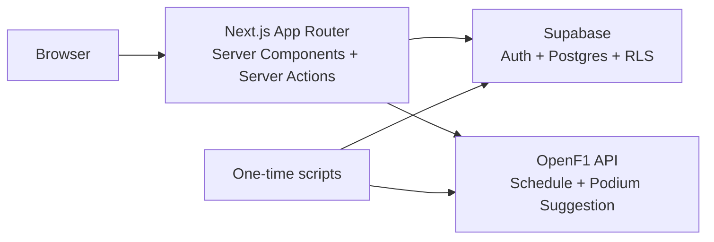
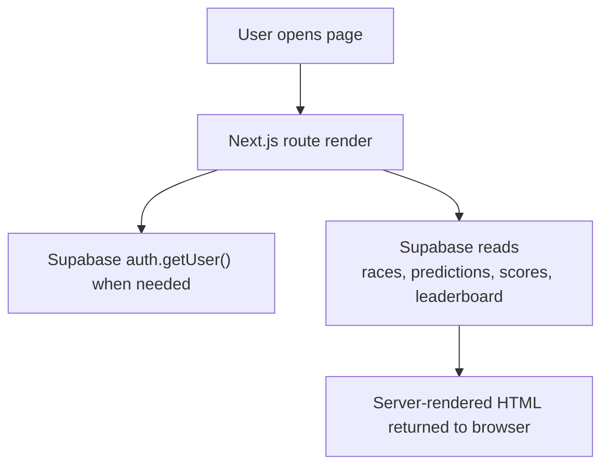
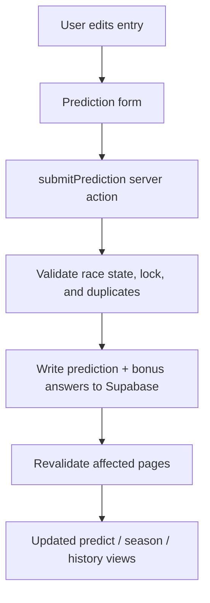
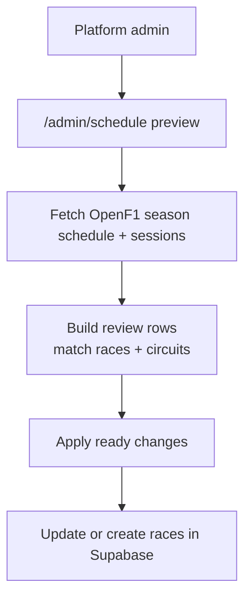
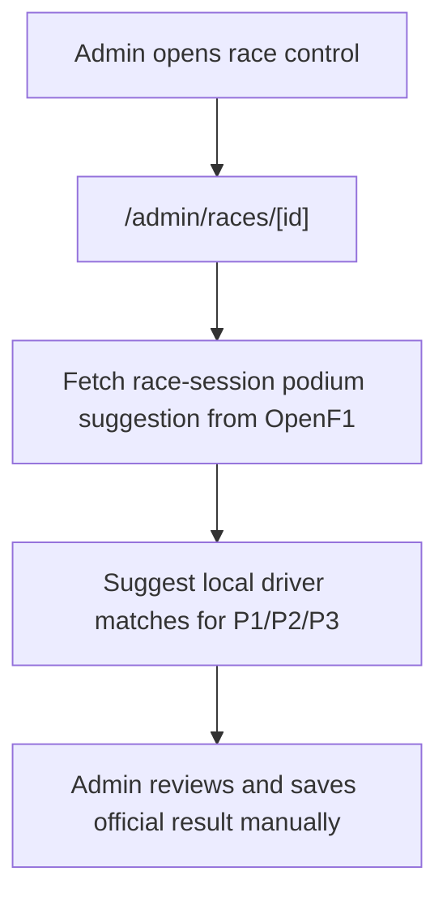
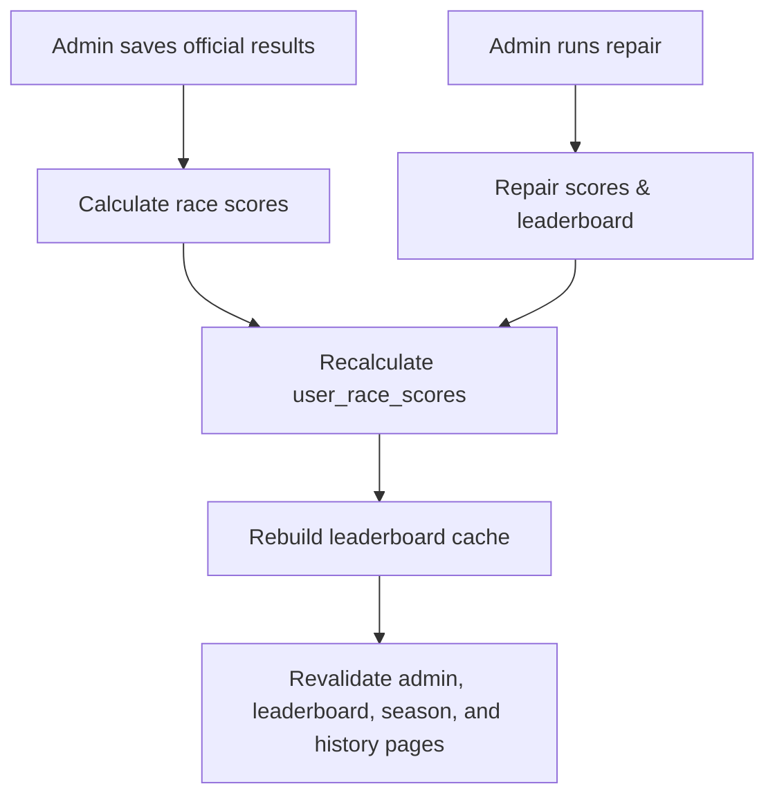

# FLO-RMULA 1 Predictions App

FLO-RMULA 1 is a Formula 1 prediction pool built with Next.js and Supabase. Users submit podium picks and bonus answers for each race, follow their season from a dashboard, and review scored results once admins publish official outcomes.

## Current Product

### User Experience
- Leaderboard-first public homepage with standings as the main story
- Public season hub in `/season` for upcoming weekends, recent results, and season standings
- About page in `/about` for maintainer references and product dependencies
- Season dashboard for the current season
- Podium prediction flow for open races
- Locked, completed, and scored race states with read-only summaries
- Bonus question support per race
- Personal season history with missed-weekend visibility
- Tenant and global leaderboard views with smart defaults
- Expandable leaderboard transparency with race-by-race podium audit on scored weekends
- User-managed display name settings in `/me/profile`
- Race-themed pending and loading states for navigation and auth flows
- Email/password authentication with Supabase

### Admin Experience
- In-app admin navigation for platform admins and tenant admins
- Tenant and account access management in `/admin/tenants`
- Test Mode flags for groups and accounts so invite/onboarding tests can be isolated from public standings
- Tenant operations workspace in `/admin/tenant`
- Group invite links that can be copied again from the tenant workspace after the latest invite migration
- Race calendar management
- OpenF1-backed schedule sync review in `/admin/schedule`
- Bonus question management per race
- Official result entry
- Score calculation and leaderboard cache rebuild
- Driver reference data management
- Manual maintenance action for race status updates

## Product Shape

The app currently uses one shared F1 race calendar and one shared official result source.

Current tenant model:
- one tenant per account
- shared global race calendar and shared official results
- tenant-specific competition context layered on top of shared race data
- global leaderboard = all tenants combined
- tenant leaderboard = only users in that tenant
- signed-in tenant members default to their tenant leaderboard, while platform admins and unassigned users default to global
- platform admins can also belong to a tenant and participate in the pool; platform rights come from `admin_scope`, not from being unassigned

This keeps scheduling, timing, and future automated race-data ingestion centralized instead of duplicating race operations per tenant.

## Roles And Permissions

- `user`
  Can access the private competition experience only after tenant assignment.
- `admin` with `admin_scope = platform`
  Acts as the platform admin. Can manage tenants, shared race data, scoring, and reference data for the whole product, while still optionally belonging to a tenant as a participant.
- `admin` with `admin_scope = tenant`
  Is explicitly scoped away from platform-wide control. Can open `/admin/tenant` to monitor roster health, tenant standings, and race-entry coverage without touching shared race control.

In practical terms:
- race schedules, bonus questions, official results, and scoring inputs are entered once by a platform admin and reused by all tenants
- tenant membership only affects competition context and leaderboard slicing
- missing public display names fall back to a sanitized email-derived predictor name instead of `Anonymous`
- app-visible profiles are treated as confirmed users only; pending email confirmations should not appear in admin account lists
- groups or accounts marked as test are excluded from public/global standings by default
- scored leaderboard transparency can be shown publicly because scored predictions and scored user race scores are readable after results are published

Detailed execution tracking lives in [docs/roadmap/README.md](</Users/nareshmadhur/Tech Projects/Flormula1-Predictor/docs/roadmap/README.md>).

## Core Journeys

### User
1. Sign up and confirm email.
2. While waiting for tenant assignment, browse the public leaderboard and set a public display name in `/me/profile`.
3. Get assigned to a tenant by a platform admin.
4. Sign in and land on the season dashboard at `/predictions`.
5. Open the next race and submit podium picks plus bonus answers.
6. Revisit the same race after lock to see the submitted entry.
7. Return after scoring to see official results, point breakdown, and rank movement.
8. Use `/leaderboard` to switch between tenant and global standings, then open any predictor row to inspect scored race detail.

### Platform Admin
1. Sign in as a platform admin.
2. Open `Admin` from the main navigation.
3. Open `/admin/tenants` to create tenants and set each account's role, admin scope, and tenant assignment.
4. Mark test groups/accounts in `/admin/tenants` when validating signup, invites, or scoring flows.
5. Create or update races for the season.
6. Add bonus questions and official answers.
7. Save official podium results.
8. Calculate scores and refresh the leaderboard.

### Test Mode
- Mark a group as `Test` to keep everyone in that group out of public/global standings.
- Mark an individual account as `Test` to exclude only that account from public/global standings.
- Test users can still use their own group leaderboard, predictions, and history.
- Platform admins can manage test flags from `/admin/tenants`.
- Keep a reusable test group and a few reusable test accounts instead of deleting Supabase Auth users after each flow.

### Tenant Admin
1. Sign in as a tenant admin.
2. Open `Admin` from the main navigation.
3. Land in `/admin/tenant` to inspect tenant roster health, leaderboard state, and race-entry coverage.
4. Create and copy invite links from the group invite panel when bringing people into the group.
5. Use the tenant leaderboard and season history to spot missed weekends and competition momentum.

## Technical Overview

- Framework: Next.js 16 App Router
- UI: React 19, TypeScript, Tailwind CSS 4
- Backend: Supabase Auth + Postgres + RLS
- Data writes: Server Actions
- Session handling: Supabase SSR helpers
- Caching: `revalidatePath` and `leaderboard_cache`

Important app areas:
- `app/page.tsx`: public homepage
- `app/predictions/page.tsx`: authenticated season dashboard
- `app/race/[id]/predict/page.tsx`: race lifecycle view
- `app/leaderboard/page.tsx`: current-season leaderboard
- `app/me/profile/page.tsx`: member profile and display-name settings
- `app/admin/*`: admin workflows
- `app/about/page.tsx`: credits and dependency references
- `app/actions/*`: server actions
- `utils/openf1.ts`: OpenF1 schedule ingestion and review mapping
- `supabase/migrations/*`: schema and data model

## Runtime Architecture

### When API Calls Happen

The app uses two kinds of APIs:
- Supabase
  This is the main runtime backend. Most page requests and nearly all writes go through Supabase.
- OpenF1
  This is only used for admin/import workflows and one-off reference-data sync scripts.

In practice:
- normal page loads use Next.js server rendering plus Supabase reads
- user actions like submitting predictions use server actions plus Supabase writes
- admin schedule sync uses OpenF1 for season/session data, then writes reviewed updates into Supabase
- admin race control can use OpenF1 to suggest a podium, but does not auto-publish results
- one-time scripts can pull OpenF1 reference data into Supabase without changing historic prediction IDs

### System Diagram



### Block Descriptions

- `Browser`
  The user interface in the client. It mostly receives already-rendered HTML from the Next.js server and triggers navigation or form submissions.
- `Next.js App Router`
  The application runtime. Server components fetch data for page renders, and server actions handle trusted writes such as prediction saves, admin edits, and scoring operations.
- `Supabase`
  The primary system of record. It handles auth, profiles, tenants, races, predictions, scores, leaderboard cache, drivers, constructors, circuits, and official results.
- `OpenF1 API`
  The external source used for season schedule/session import and optional podium suggestions on admin race pages.
- `One-time scripts`
  Local maintenance scripts used for seed/setup/reference-data sync, such as updating current drivers and constructors to match the latest OpenF1 grid.

## Request And Action Flows

### 1. Read Flow



What this means:
- most pages do not call external APIs directly from the browser
- the Next.js server reads from Supabase and returns the final UI
- this applies to pages like `/`, `/season`, `/leaderboard`, `/predictions`, `/me/history`, and `/race/[id]/predict`

### 2. Prediction Flow



What this means:
- prediction submission is trusted server-side logic
- bonus answers are written alongside podium picks
- lock enforcement is checked again on the server before saving

### 3. Schedule Import Flow



What this means:
- OpenF1 is not continuously syncing in the background today
- admins preview imported data before applying it
- unmatched circuits stay in review until they are mapped or created

### 4. Podium Suggestion Flow



What this means:
- OpenF1 can suggest the podium
- official race results are still admin-reviewed and manually saved
- bonus answers remain fully app-specific and manual

### 5. Scoring And Repair Flow



What this means:
- scoring remains intentionally manual today
- the manual step is safer because official result review and bonus-answer entry are admin-controlled
- repair tools exist to recover from historic edits or stale leaderboard state

## Necessary Flows To Understand

These are the flows worth documenting and maintaining clearly:
- `Read flow`
  How public and private pages fetch current state from Supabase.
- `Prediction flow`
  How user picks are validated and saved.
- `Schedule import flow`
  How OpenF1 data becomes reviewed race/session data in the app.
- `Podium suggestion flow`
  How OpenF1 can assist result entry without becoming the final source of truth.
- `Scoring and repair flow`
  How official results become user scores and leaderboard totals.
- `Auth and access flow`
  How platform admins, tenant admins, assigned users, and unassigned users are routed differently through the app.

## Data Model

Core tables:
- `profiles`
- `races`
- `predictions`
- `prediction_bonus_answers`
- `bonus_questions`
- `bonus_options`
- `race_results`
- `race_bonus_answers`
- `user_race_scores`
- `leaderboard_cache`
- `drivers`
- `constructors`
- `circuits`

Notes:
- predictions are unique per `user_id + race_id`
- scores are unique per `user_id + race_id`
- leaderboard cache is unique per `season + user_id`
- shared race data is tenant-agnostic
- tenant membership lives on `profiles.tenant_id`
- explicit admin scope lives on `profiles.admin_scope`

## Scoring

- 3 points for an exact podium position
- 1 point for the right driver in the wrong podium position
- bonus points come from the question configuration
- prediction lock defaults to 5 minutes before FP1, with race start only used as a temporary fallback for legacy races missing FP1

## Setup

### Prerequisites
- Node.js 18+
- npm
- Supabase project

### Install
```bash
npm install
```

### Environment

Create `.env.local`:

```bash
NEXT_PUBLIC_SUPABASE_URL=your_supabase_url
NEXT_PUBLIC_SUPABASE_ANON_KEY=your_anon_key
SUPABASE_SERVICE_ROLE_KEY=your_service_role_key
NEXT_PUBLIC_SITE_URL=https://www.flormula1.nl
```

`NEXT_PUBLIC_SITE_URL` is the canonical public domain used for shareable links, auth email callbacks, metadata, robots, and sitemap URLs.

Set it in:
- `.env.local` for local development. Use `http://localhost:3000` if you want auth email links to return to your local app.
- your deployment provider environment variables for production

In Supabase Auth URL Configuration:
- Set `Site URL` to `https://www.flormula1.nl` or `https://flormula1.nl`, including `https://`.
- Do not set it to `www.flormula1.nl` without the protocol. Supabase treats that as a path on the Supabase project domain.
- Keep the app's `NEXT_PUBLIC_SITE_URL` aligned with the chosen canonical Site URL.

Keep these redirect URLs allowlisted:
- `https://www.flormula1.nl/auth/callback`
- `https://flormula1.nl/auth/callback`
- `http://localhost:3000/auth/callback` for local testing

### Seed Data

Example:

```bash
node scripts/seed-official.mjs
```

### Run
```bash
npm run dev
```

## Available Scripts

```bash
npm run dev
npm run build
npm run start
npm run lint
```

## Known Gaps

- No automated test suite is currently included.
- Some repo-wide lint issues still exist outside the most recently updated files.
- Race schedule and results are still managed manually.
- Schedule and timing import now supports OpenF1 review/apply, but official results remain manual.
- Tenant admins currently have a read-focused operations workspace; invitation and self-serve member management are still future work.

## Roadmap

### Step 1
- completed foundation and safety work for tenants, private competition guards, and platform-admin boundaries

### Step 2
- completed tenant product experience work, including tenant ops, clearer tenant/global context, missed-weekend visibility, richer scored-race recap, explainable leaderboard detail, and self-managed profile naming

### Step 3
- public season and race result surfaces
- automated schedule and timing ingestion with OpenF1 review/apply
- reminder and retention loops
